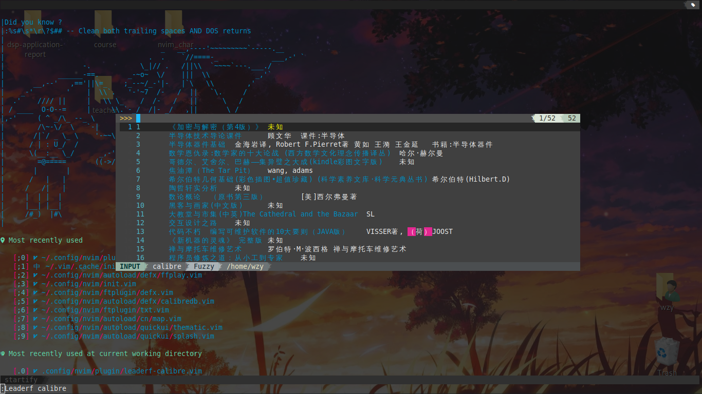

leaderf-calibre
===============

Yet another calibre client for vim. And a leaderf source of calibre.

Features
--------

- Search ebooks by some information (title, author, tags, language and you
can determine it).
- View ebooks.
- View cover of ebooks.
- Open the directory where ebooks exist.
- Copy the paths of ebooks to clipboard.
- Change the metadata (e.g. author, title, etc) and bookmarks of ebook
which filetype is pdf. Need
[Freed-Wu/pdftk.vim](https://github.com/Freed-Wu/pdftk.vim), this
operation will modify ebooks.
- Change the metadata (e.g. author, title, tags, etc) of ebooks. Need 
[kovidgoyal/calibre](https://github.com/kovidgoyal/calibre), this operation
only modify these metadata stored in calibre so the ebooks will not be
modified.
- Remove ebooks from calibre to trash bin.
- Remove ebooks from calibre. Delete them permanently.
- Copy ebooks to current directory.

Thanks
------

- [chenyanming/calibredb.el](https://github.com/chenyanming/calibredb.el)

Dependency
----------

- [Yggdroot/LeaderF](https://github.com/Yggdroot/LeaderF)
- [mackyle/sqlite](https://github.com/mackyle/sqlite)
